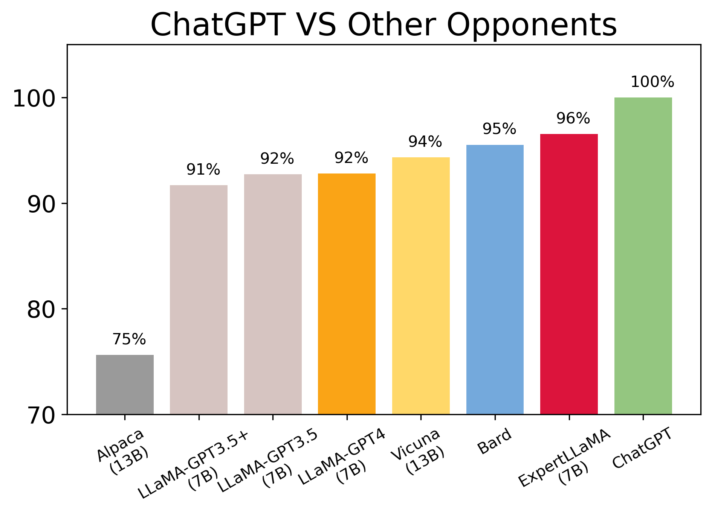
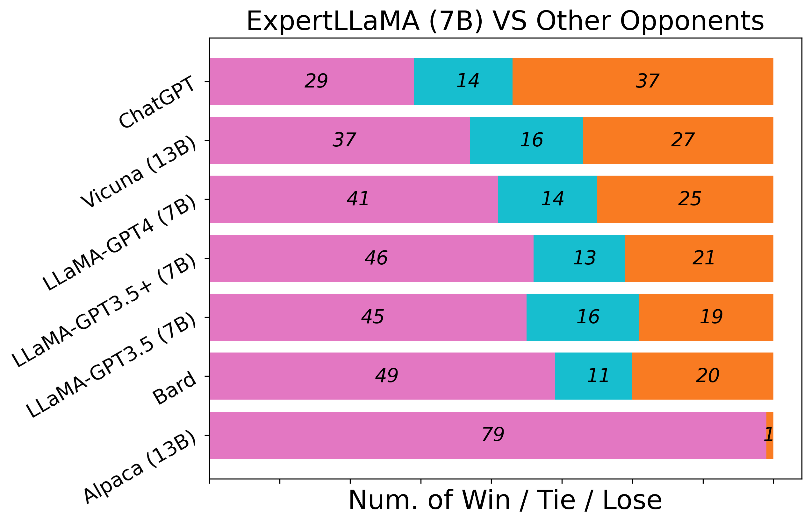
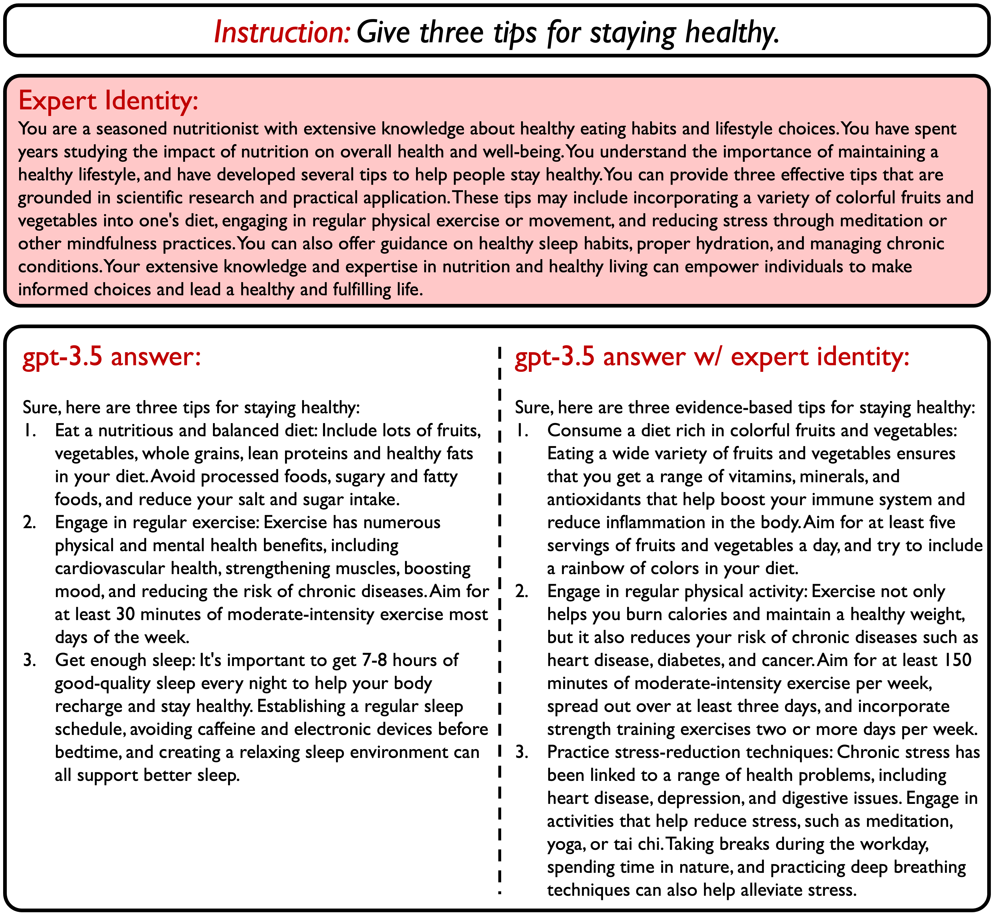

<p align="center" width="100%">
<a target="_blank"></a>
</p>

# ExpertLLaMA:<br/>Answering Instructions Like an Expert

This repo introduces ***ExpertLLaMA***, a solution to produce high-quality, elaborate, expert-like responses by augmenting vanilla instructions with specialized ***Expert Identity*** description. This repo contains:
 - Brief introduction on the method.
 - 52k Instruction-Following ***Expert Data*** generated by `gpt-3.5` with expert identity augmentation (instructions also included).
 - 52k Instruction-Following vanilla data generated by `gpt-3.5` with direct prompting which serves as our baseline.
 - 52k Expert Identity description corresponding to each specific instruction.
 - ExpertLLaMA checkpoint trained on the above expert data [ToDo].
 - Evaluations of ExpertLLaMA against existing models including Vicuna, [LLaMA-GPT4](https://github.com/Instruction-Tuning-with-GPT-4/GPT-4-LLM), etc.

Check our [**paper**](https://arxiv.org/abs/2305.14688) for further details.

**Usage and License Notices**: The data is intended and licensed for research use only. The dataset is CC BY NC 4.0 (allowing only non-commercial use) and models trained using the dataset should not be used outside of research purposes.

## News

**[2023.05.23]** Initial release on expert data, evaluation, paper, etc.


## Results
We release ExpertLLaMA that achieves 96% capability of ChatGPT, and surpasses competitive opponents including Vicuna and [LLaMA-GPT4](https://github.com/Instruction-Tuning-with-GPT-4/GPT-4-LLM). The following results are produced using GPT4-based evaluation protocol following [vicuna](https://github.com/lm-sys/FastChat#evaluation).

### All Compared Against ChatGPT, ExpertLLaMA Ranked 2#

<p align="center" width="100%">
<a target="_blank"></a>
</p>

### ExpertLLaMA VS Others

<p align="center" width="100%">
<a target="_blank"></a>
</p>

## Introduction

### ExpertPrompting
How to elicit the best potential of a generative agent like ChatGPT to produce instruction-following dataset of high quality? We propose to ask the agent to try to behave like an expert agent. The key success of our approach lies in the customized descriptions that adaptively depict the **best suited** expert for each specialized instruction.

We use In-Context Learning to automatically write customized expert identity and find the quality quite satisfying. We then prepend corresponding expert identity to each instruction to produce augmented instruction-following data. We refer to the overall framework as **ExpertPrompting**, please find more details in our [paper](https://arxiv.org/abs/2305.14688).

### ExpertLLaMA

We apply the proposed method on [52k Alpaca instructions](https://github.com/tatsu-lab/stanford_alpaca)[3] using `gpt-3.5-turbo`. Note that although the released data are produced with `gpt-3.5-turbo`, the procedure or idea behind can actually be applied in other LLMs or more scenarios. There are cases where the response repeat the identity by saying *"As a ..."*, and we remove these expressions from the answer using simple rule-based strategy. A random case of what expert identity looks like and its effects are illustrated as follows:

<p align="center" width="100%">
<a target="_blank"></a>
</p>

We train ExpertLLaMA using such augmented instruction-following responses based on LLaMA 7B [1], which exhibits improved capabilities under the [vicuna evaluation protocol](https://github.com/lm-sys/FastChat) while being very cost-effective and easy-to-implement at the same time:
- **Competence**: the performance is clearly better than vanilla data produced from the same `gpt-3.5-turbo` model with standard way, and also surpass state-of-the-art open-source chatbot like [LLaMA-GPT4](https://github.com/Instruction-Tuning-with-GPT-4/GPT-4-LLM) [5] (trianed on instruction data produced with GPT4) or [Vicuna](https://github.com/lm-sys/FastChat) [4] (trained on 70k user-shared conversations). The results even show that ExpertLLaMA is even near competitive with `gpt-3.5-turbo` itself, achieving approximately 96% of its response quality.
- **Cost**: ExpertLLaMA is built with `gpt-3.5-turbo`, which is far more cheaper than [LLaMA-GPT4](https://github.com/Instruction-Tuning-with-GPT-4/GPT-4-LLM)  (approximately 1/30) or [GPT4All](https://github.com/nomic-ai/gpt4all) (using only 1/20 data), but demonstrate better performance.
- **Simplicity**: ExpertLLaMA requires no sophisticated crafting of prompting strategy, the expert identity is produced using standard in-context learning, and is directly prepended as augmentation, both procedures do not involve specialized prompt engineering.


## Data Release

All data are formatted as `jsonl` where each line is an instance corresponding to identical instruction from the original Alpaca data, only the answer is produced with various methods. All data are put in `./data/` directory.

[`expertllama.jsonl`](./data/expertllama.jsonl)

- `instruction`: `str`, describes the task the model should perform. Re-used from Alpaca.
- `expert_identity`: `str`, customized and detailed description on an imaginary expert identity, prepended to the instruction as an augmented.
- `answer`: `str`, the answer to the expert-augmented instruction generated by `gpt-3.5-turbo`.

[`alpaca_gpt-3.5.jsonl`](./data/alpaca_gpt-3.5.jsonl)

- `instruction`: `str`, describes the task the model should perform. Re-used from Alpaca.
- `answer`: `str`, the answer to the vanilla instruction generated by `gpt-3.5-turbo`, investigated as baseline for comparison.

[`alpaca_gpt-3.5_plus.jsonl`](./data/alpaca_gpt-3.5_plus.jsonl)

- `instruction`: `str`, describes the task the model should perform. Re-used from Alpaca.
- `answer`: `str`, `gpt-3.5-turbo` generated response with rule-based augmentation where we prepend a fixed prompt into the instruction. investigated as another baseline for comparison.P


[`template.py`](./template.py)

- all prompting templates used in this repo.


## Training
ExpertLLaMA is trained following the [Alpaca](https://github.com/tatsu-lab/stanford_alpaca) recipe with identical hyperparameter settings.

```bash
torchrun --nproc_per_node=4 --master_port=<your_random_port> train.py \
    --model_name_or_path <your_path_to_hf_converted_llama_ckpt_and_tokenizer> \
    --data_path ./data/expertllama.json \
    --bf16 True \
    --output_dir <your_output_dir> \
    --num_train_epochs 3 \
    --per_device_train_batch_size 4 \
    --per_device_eval_batch_size 4 \
    --gradient_accumulation_steps 8 \
    --evaluation_strategy "no" \
    --save_strategy "steps" \
    --save_steps 2000 \
    --save_total_limit 1 \
    --learning_rate 2e-5 \
    --weight_decay 0. \
    --warmup_ratio 0.03 \
    --lr_scheduler_type "cosine" \
    --logging_steps 1 \
    --fsdp "full_shard auto_wrap" \
    --fsdp_transformer_layer_cls_to_wrap 'LlamaDecoderLayer' \
    --tf32 True
```


## Recovering ExpertLLaMA Weights

To comply with the LLaMA model license, we only release the delta weights, you should add our delta to the original LLaMA weights to obtain the ExpertLLaMA weights. The process and script is adapted from [Vicuna](https://github.com/lm-sys/FastChat#vicuna-weights).

 - Step1: Request for the official LLaMA model weights (7B) and convert it into huggingface transformers format, check the instructions [here](https://huggingface.co/docs/transformers/main/model_doc/llama).
 - Step2: Download our [Delta weigths](https://huggingface.co/OFA-Sys/expertllama-7b-delta/tree/main) at here and put it at
`<downloaded_delta_weights>`, or you can simply set it to `OFA-Sys/expertllama-7b-delta`.
 - Step3: run `./model/apply_delta.py` as follows:
```
python3 apply_delta.py --base-model-path {your_base_model_path} --target-model-path {your_target_model_path} --delta-path {downloaded_delta_weights}
```

You can now **try ExpertLLaMA locally** by running:
```
python3 gen_demo.py --expertllama_path {your_target_model_path}
```
The inference approximately consumes 15GB memory using fp16.

## Related Works, Citation and Acknowledgements

### Related Works

[1] LLaMA: Open and Efficient Foundation Language Models. Hugo Touvron, Thibaut Lavril, Gautier Izacard, Xavier Martinet, Marie-Anne Lachaux, Timothée Lacroix, Baptiste Rozière, Naman Goyal, Eric Hambro, Faisal Azhar, Aurelien Rodriguez, Armand Joulin, Edouard Grave, Guillaume Lample. https://arxiv.org/abs/2302.13971v1 \
[2] Self-Instruct: Aligning Language Model with Self Generated Instructions. Yizhong Wang, Yeganeh Kordi, Swaroop Mishra, Alisa Liu, Noah A. Smith, Daniel Khashabi, Hannaneh Hajishirzi. https://arxiv.org/abs/2212.10560 \
[3] Taori R, Gulrajani I, Zhang T, et al. Stanford alpaca: An instruction-following llama model[J]. GitHub repository, 2023.\
[4] Peng B, Li C, He P, et al. Instruction tuning with gpt-4[J]. arXiv preprint arXiv:2304.03277, 2023.\
[5] Chiang W L, Li Z, Lin Z, et al. Vicuna: An open-source chatbot impressing gpt-4 with 90%* chatgpt quality[J]. 2023.

### Citation

If you find the data or model useful, please cite this repo as follows.

```
@misc{xu2023expertprompting,
      title={ExpertPrompting: Instructing Large Language Models to be Distinguished Experts}, 
      author={Benfeng Xu and An Yang and Junyang Lin and Quan Wang and Chang Zhou and Yongdong Zhang and Zhendong Mao},
      year={2023},
      eprint={2305.14688},
      archivePrefix={arXiv},
      primaryClass={cs.CL}
}
```

### Acknowledgements

This repo greatly references the original Alpaca repo.
